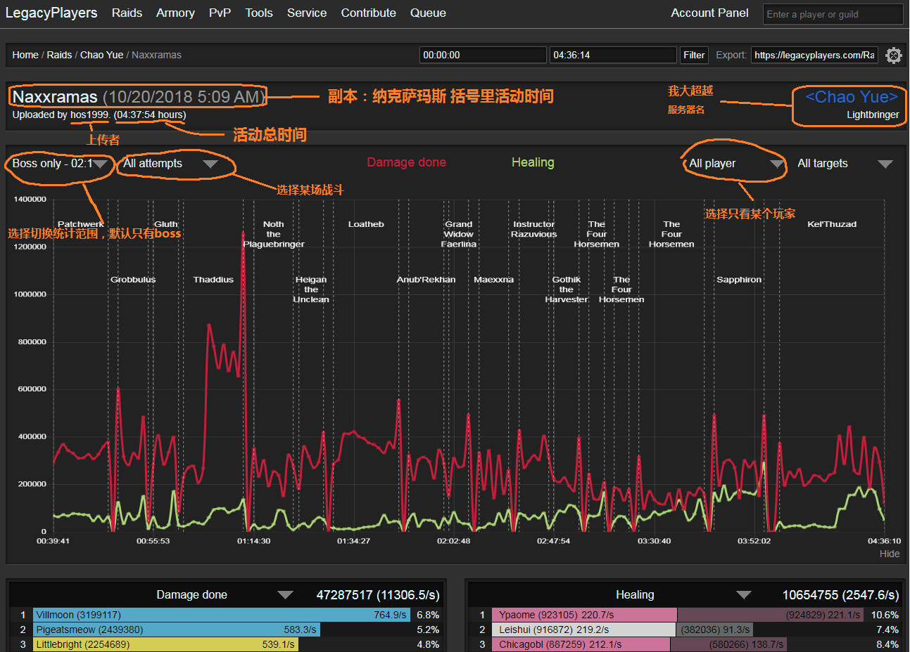
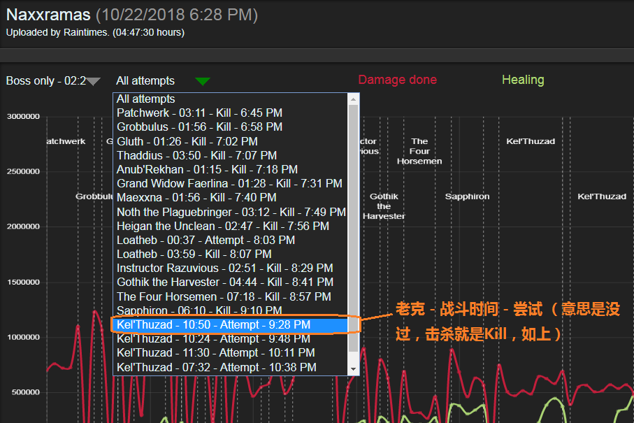
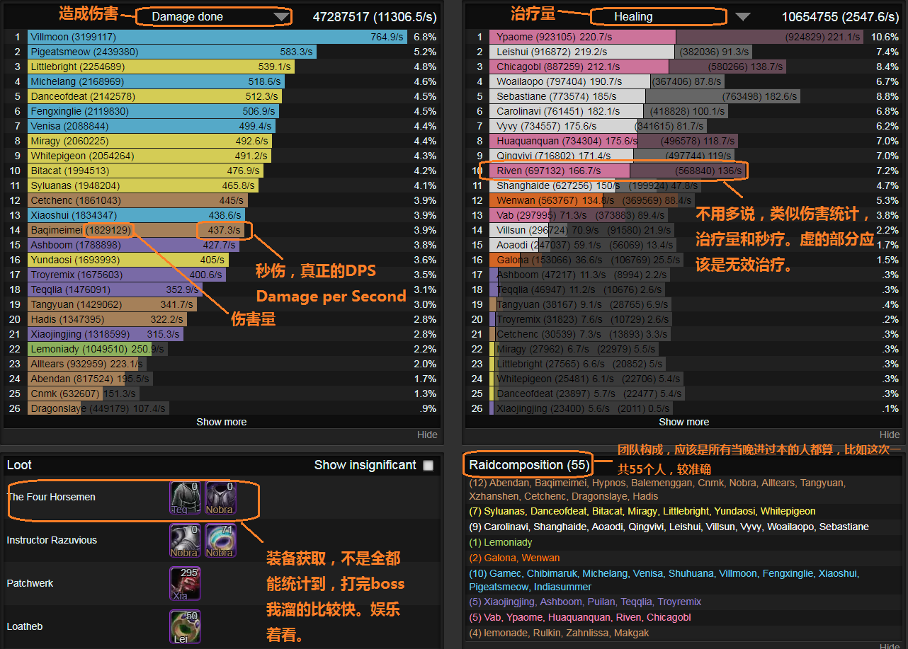
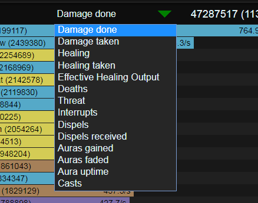
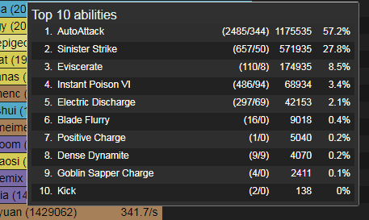
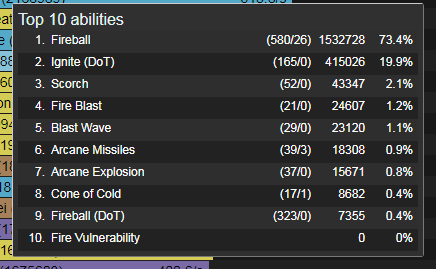
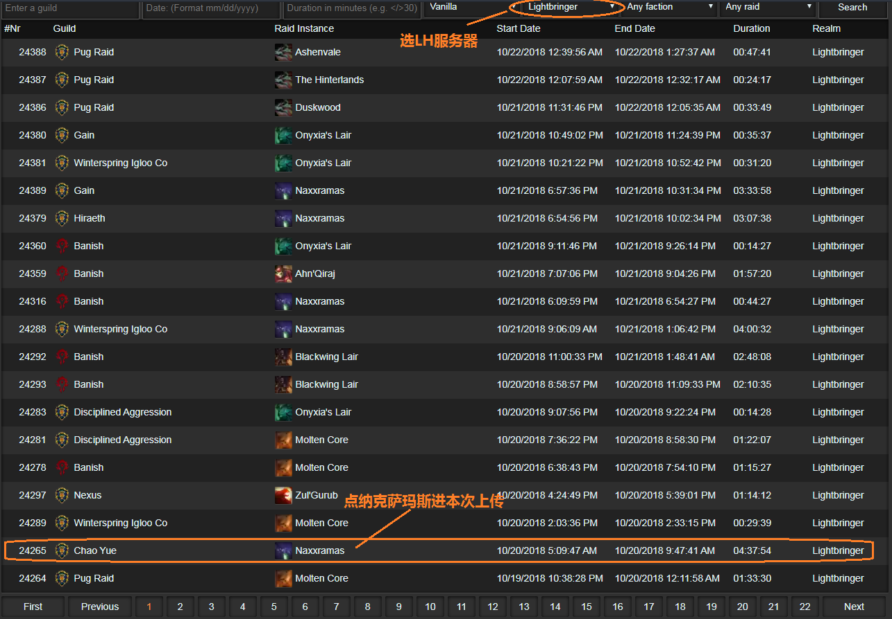

# LegacyPlayers(怀旧玩家) 数据上传网站使用教程

## 引言

https://legacyplayers.com 是以方便怀旧服玩家社区为初衷而建立的一个非营利网站，它向玩家提供PVE，PVP相关的数据查询，检索。 当然，〈超越〉的朋友们对它也一定不会陌生了，这个网站在最近每次打本结束之后都会被团员发到群里作为当晚数据统计的标准地址。 对于每次活动的记录，大部分玩家最关心的DPS，治疗量数据这个网站都包含。除此以外，它其实还详细地，忠实地记录了dps统计插件收录的相关统计，如死亡次数，死亡原因，攻击/治疗技能释放次数，清除法术施放次数等等。 然而它因为不支持中文，令玩家们徒生敬畏。这个教程旨在尽可能消除这种隔阂，引导玩家养成每次打本之后研读自己，团队表现，总结，分析的习惯，从而逐步走向高端。

## 活动记录页面

活动记录页面提供的是最主要信息，也是我认为最有价值的信息。它包含伤害统计插件能记录到的数据，以伤害，治疗量等为主。（这个网站现在越来越受欢迎，用的人多了有时候也会崩，如果你看到504 Gateway Time-out这样的白页，稍后再来吧）

:warning:强烈建议认真对待的朋友，用电脑看这个页面，这个网站的很多JS脚本对于手机端支持的不是很好。

### 如何读懂单次活动记录？

以P团10月20号的活动为例： https://legacyplayers.com/Raids/Viewer/?id=24265&exp=0
首先让我们来看看这个页面上半部分，副本和活动时间不用说了。值得一提的是，这个主页面每次进入的默认视角是只有boss数据，并且是全程。如果想看所有，需要如图点选下拉菜单切换到"Boss & Trash"（boss及小怪）。

也可以只看某个boss的输出，点选菜单切换到单个boss战，如图

下半部分，是重中之重，数据列表，默认是左边伤害，右边治疗。

也可以点选单个列表的表头下拉菜单，切换视角，比如点“Damage Done”，可以看到这些：

内容依次是

统计类型 | 说明
------------ | -------------
Damage Done | 伤害
Damage Taken | 承受伤害
Healing | 治疗量
Healing Taken | 接受治疗量
Effective Healing Output | 有效治疗量
Deaths | 死亡次数
Threat | 仇恨
Interrupts | 打断次数
Dispels | 驱散次数；包含所有类型(魔法，毒，诅咒等等)
Dispels received | 接受驱散次数
Casts | 技能使用

选中以后会切换到这个内容的视角，比如死亡次数，会给出所有人死亡次数列表。 注意这些列表都是根据上面的主选项的视角对应的，比如你上面选了“只有Boss” + “克尔苏加德” + “死亡次数”，得到的就是老克这场战斗的死亡次数。

### 技能分析，手法分析

如果把鼠标移到数据列表某个玩家数据条上，比如伤害条上，会出现一个小框，这个框代表这个数据条的明细。
比如这个盗贼的前十技能使用，每一行是一个技能，第一行是“自动攻击（2485下/344下未命中）总伤害 伤害占比”

这个是法师的：

这个意义在于，看自己的技能比重，比如法师搓了几个火球，打了几个灼烧，某个技能在所有使用技能的占比。和同职业的比较，就能明显看出差距。具体技能请和职业队长，团员们在职业群里探讨。

### 扑街次数

这个很有意思，看自己某个Boss，小怪死于哪个技能，可以用来查死老克裂隙，OT死之类的，一般Boss战OT就会死于Boss的自动攻击。

### 驱散次数

这个很重要，有没有解毒，冰龙有没有接诅咒一目了然。

### 怎样从大页找到〈超越〉单次活动记录？

我懒得翻群消息找老米头发的数据链接了。没问题，直接去大页 https://legacyplayers.com 最上面一行，点"Raids"，得到活动记录列表，按照上传时间先后排列，有别的服务器，也有别的公会，见图

当然也可以直接从大页搜索 "chao yue"，也会返回结果。

### 历史活动记录

只要当天活动有人上传，网站上都有历史记录，除非当天有特殊情况，比如上传的人电脑崩了，或者出去替补，数据会有断档。可以回翻自己以前的数据，比如两个月前，进行对比，总结自己的进步，以及提升空间。

## 玩家页面

如果你对某个玩家的数据感兴趣，大页搜索玩家角色名，或者从活动记录页面右下角的单次活动人员构成找到这个玩家的玩家页面，里面有他最近某个时间点的装备，LegacyPlayers上记录过的他参加过的活动，还有我发现比较有意思的是最右边一栏的历史数据，某个boss这个玩家的最好dps，平均dps，和同职业比排名，所有职业比排名 :smirk:

截图说明就免了有兴趣的自己看吧 比如这位： https://legacyplayers.com/Armory/?charid=759421

## 杂项

* 无关紧要的功能，看看别的公会打得怎么样，可以大页搜索，比如酒馆 “Covenant A”，当然前提是这个公会也有人定期上传数据，国人公会上传数据的恐怕就只有超越和酒馆了。

* 从玩家个人页面可以点某个装备，可以获得其它拥有这个装备的人（潜在用途：比比谁更红，或者:poop:？）

* 天赋模拟器，大页点 Tools -> Talent Calculator

还有什么有意思的功能，暂时待挖掘，欢迎补充:beers:
